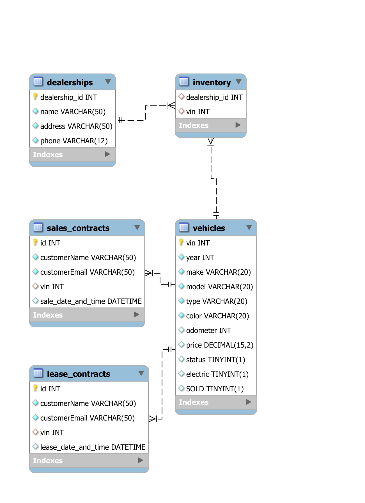

# Dealership Database

## Description of the Project

Dealership Database is designed to manage and track vehicle inventory, sales contracts, and lease contracts for car dealerships. It serves as a comprehensive solution for dealerships to maintain detailed records of their vehicles, manage sales and leases, and provide essential information about their inventory.

## Technologies Used

- Git Bash
- MySQL Workbench: Database management system for persisting dealership data.

## Demo

<figure>
    
    <figcaption><i>Database Diagram</i></figcaption>
</figure>

## Thanks

Express gratitude towards those who provided help, guidance, or resources:

- Thank you to Raymond for continuous support and guidance.
- A special thanks to all teammates for their dedication and teamwork.

